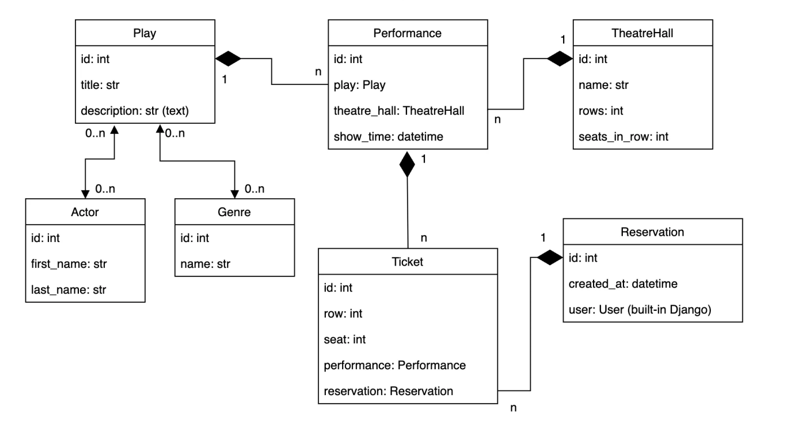

# Theatre Service API

Theatre Service API is a backend service for managing theatre content, performances, reservations, and user accounts. The project is built with Django, Django REST Framework, PostgreSQL, and Docker, and includes interactive API documentation with Swagger and ReDoc.

## Features

- Custom user model with registration and authenticated profile management.
- JWT authentication with token obtain, refresh, and verify endpoints.
- CRUD operations for genres, actors, plays, theatre halls, and performances.
- Reservation management for authenticated users.
- Interactive API documentation with Swagger UI and ReDoc.
- Ready-to-load demo data in `theatre/fixtures/theatre_service_data.json`.
- PostgreSQL-based persistent storage.
- Dockerized development environment.

## Tech Stack

- Python 3.12
- Django
- Django REST Framework
- PostgreSQL
- Docker
- Docker Compose
- drf-spectacular
- Simple JWT
- Pillow

## Getting Started

### 1. Clone the repository

```bash
git clone https://github.com/Livan94/theatre-service-api.git
cd theatre-service-api
```

### 2. Create and activate virtual environment

#### Linux / macOS

```bash
python -m venv .venv
source .venv/bin/activate
```

#### Windows PowerShell

```powershell
python -m venv .venv
.venv\Scripts\Activate.ps1
```

#### Windows cmd

```cmd
python -m venv .venv
.venv\Scripts\activate.bat
```

### 3. Configure environment variables

Create a `.env` file from the sample:

```bash
cp .env-sample .env
```

Make sure the file contains the required variables, including:

- `DJANGO_SECRET_KEY`
- `POSTGRES_DB`
- `POSTGRES_USER`
- `POSTGRES_PASSWORD`
- `POSTGRES_HOST`
- `POSTGRES_PORT`

### 4. Build and start Docker containers

```bash
docker compose build
docker compose up
```

### 5. Create a superuser

```bash
docker compose exec app python manage.py createsuperuser
```

## Demo Data

The project includes ready demo data in:

```text
theatre/fixtures/theatre_service_data.json
```

This fixture is useful for quickly populating the database with sample:

- genres
- actors
- theatre halls
- plays
- performances

## Database Structure

The database schema diagram is shown below:



## Documentation

After the server starts, API documentation is available at:

- Swagger UI: [http://localhost:8000/api/doc/swagger/](http://localhost:8000/api/doc/swagger/)
- ReDoc: [http://localhost:8000/api/doc/redoc/](http://localhost:8000/api/doc/redoc/)
- OpenAPI schema: [http://localhost:8000/api/schema/](http://localhost:8000/api/schema/)

## Key Endpoints

### User endpoints

- `POST /api/user/register/` — register a new user
- `GET /api/user/me/` — retrieve current authenticated user profile
- `PATCH /api/user/me/` — update current authenticated user profile
- `POST /api/user/token/` — obtain JWT access and refresh tokens
- `POST /api/user/token/refresh/` — refresh access token
- `POST /api/user/token/verify/` — verify token validity

### Theatre endpoints

- `GET /api/theatre/` — API root
- `GET /api/theatre/genres/`
- `GET /api/theatre/actors/`
- `GET /api/theatre/theatre-halls/`
- `GET /api/theatre/plays/`
- `GET /api/theatre/performances/`
- `GET /api/theatre/reservations/`

### Notes about permissions

- Theatre catalogue endpoints such as genres, actors, theatre halls, plays, and performances are available through the theatre API router.
- Reservation endpoints are intended for authenticated users.
- Some create, update, and delete actions are restricted to admin users.